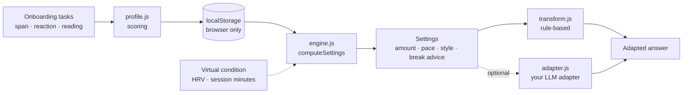

<p align="center">
  <picture>
    <source media="(prefers-color-scheme: dark)" srcset="docs/img/logo-dark.svg">
    
  </picture>
</p>

# Attune — AI that attunes to you.

> **Prototype. Not a medical device. Not a diagnosis. Not scientifically validated.**
> Sensor values in this repo are **virtual** (sliders / sample JSON). No sensor is read.
>
> **License: PolyForm Noncommercial 1.0.0 — source-available, not open source (OSI).** Noncommercial use is free; commercial use needs a separate license. Working name; not affiliated with any other "Attune". See [License](#contributing--license).

**English** · [한국어](#한국어)

Fit AI answers to how *you* read: how much information, at what pace, in what shape.
Runs entirely in your browser. No build step, no dependencies, no API key, no server.

- **Onboarding** (`docs/index.html`): three short tasks (~4 min) → a personal profile JSON stored in `localStorage`.
- **Demo** (`docs/demo.html`): the same long answer at five density levels, adjusted by your profile and an optional, virtual "today's condition", with a load meter (calm / rising / break).
- **Engine** (`docs/js/engine.js`, `transform.js`): pure JS modules with unit tests (`node --test`).

## The problem

AI answers are often long and dense. How much information a person can comfortably take in varies between people and between days. A one-size-fits-all answer tires some readers out. Attune explores adapting the *output* (speed, amount, expression) instead of asking people to adapt to it.

## How it works: two layers

| Layer | When | Input | Effect |
|---|---|---|---|
| 1. Pre-measured baseline | Once, at onboarding | Number span, reaction/vigilance task, reading-comfort choices | Profile: amount, pace and style levels (1-5) plus a baseline |
| 2. Real-time adjustment (**virtual values only**) | Per session | HRV vs. personal baseline, session length | HRV >= 20% below baseline: one level lighter (>= 40%: two). Load index over threshold: break advice and a minimal summary |

Level mapping and thresholds are **assumptions** in `docs/js/engine.js` (`THRESHOLDS`). They are not validated.

## Quick start

Requires Node 18+ only for tests and the optional dev server.

```bash
git clone <your-fork-url> attune && cd attune
npm test          # node --test, Node built-ins only
npm start         # http://127.0.0.1:8080  (static server for docs/)
```

Or serve `docs/` with any static server (ES modules need http://, not file://), e.g. `python3 -m http.server -d docs`.

**GitHub Pages:** Settings -> Pages -> Deploy from a branch -> `main` / `/docs`.

Try it: open Demo, pick "Low-HRV day" or "Long session + low HRV" and watch the settings and text change. Edit the answer text or the condition JSON freely.

## Repository layout

```
docs/       static web app (GitHub Pages root): index.html (onboarding), demo.html, css/, js/, img/ (logos), favicon.svg
  js/       profile.js, engine.js, transform.js, adapter.js (pure logic, tested) · onboarding.js, demo.js, ui.js, storage.js, i18n.js (browser)
test/       node:test unit and static checks (npm test)
scripts/    serve.js (local static server, npm start)
brand/      logo work: BRAND.md (spec + comparison), overview.png, concept-2/ (chosen, applied to docs/),
            concept-1/ and concept-1b/ (candidates), archive/ (earlier concepts)
LICENSE     PolyForm Noncommercial 1.0.0 (source-available)
NOTICE      required notice, brand/name exclusion, commercial-use note
```

## Architecture



Optional LLM adapter: implement `{ name, rewrite({ text, settings, systemPrompt }) => Promise<string> }` and set `window.attuneAdapter`. Without it, or on error/timeout, the rule-based transform is used. The repo ships no network code. See `docs/js/adapter.js`.

## Roadmap (not implemented)

1. Validation: literature review, pilot studies, better measures and thresholds.
2. Apple Watch / HealthKit: on-device HRV collection (iOS companion app).
3. iPhone on-device preprocessing: only derived values (e.g. change vs. baseline) would leave the device, never raw signals.
4. Cloud or small on-device model for density control (via the adapter interface).
5. MCP server integration, after the earlier steps are validated.

## Privacy principles

- Profile and language choice live in `localStorage` only. Nothing is uploaded; shipped code contains no network calls (checked by a test).
- Export, import and delete your profile on the results page.
- Future biometric features must be opt-in, minimal, processed on-device first, and deletable.

## Limitations

- Not a medical device; not a diagnosis; no clinical claims. Tasks are simple heuristics, **not validated psychometrics**; results vary by device, input method and day.
- HRV and session values are **virtual**. Real sensor data, baselines and thresholds are unvalidated future work.
- Text transform is extractive and rule-based: it drops and regroups sentences and can lose nuance. Sentence splitting is heuristic (EN/KO).
- Tasks are visual and need keyboard, mouse or touch; not suitable for everyone. Reading/typing time is not normalised for language ability.
- Single-browser storage: clearing site data deletes the profile.

## Contributing & license

**License: [PolyForm Noncommercial License 1.0.0](LICENSE).** This repository is **source-available, not open source** (it does not meet the OSI definition).

- Allowed: personal, research, educational and other noncommercial use, including by charities, schools, public research and government bodies (see the license text for exact terms).
- Not allowed without a separate agreement: commercial use. That needs a separate commercial license or paid API access.
- Status: no commercial license is on offer yet and **no API plan or pricing exists** — a paid API/hosted option is only a plan under consideration, with no date or promise.
- Questions or commercial interest: open an issue in this repository on GitHub, or reach the author (Sehan Yun) through the GitHub profile.
- Name and logos: "Attune" and the logos in `brand/` and `docs/img/` are **not** covered by the license ([NOTICE](NOTICE)). "Attune" is a working name and this project is **not affiliated with any other product or company named Attune**.
- Contributions: see [CONTRIBUTING.md](CONTRIBUTING.md) (contributions are licensed the same way, plus a simple grant to the owner).

Brand: the chosen logo is concept 2 (a brain-shaped speech bubble whose five top arcs shift calm → rising → break, with arc thickness as a non-colour cue). It is specified in [`brand/BRAND.md`](brand/BRAND.md) and applied to `docs/`; the demo's load meter uses the same three-zone colour scale. Candidates (concept 1, 1b) and earlier concepts stay in `brand/`. Name and marks are unregistered; trademark check pending.

---

## 한국어

**Attune — AI가 나에게 맞춰 말해 주는 관계.** 사람과 AI 사이의 "사회생활"처럼, AI가 나의 인지 속도와 정보량에 맞춰 말하도록 돕는 프로토타입입니다.

> **프로토타입입니다. 의료기기가 아니며, 진단이 아니고, 과학적으로 검증되지 않았습니다.**
> 이 저장소의 센서 값은 **가상 값**(슬라이더/샘플 JSON)입니다. 실제 센서는 읽지 않습니다.
>
> **라이선스: PolyForm Noncommercial 1.0.0 — 소스 공개이며 오픈소스(OSI)가 아닙니다.** 비상업적 사용은 무료이고, 상업적 이용은 별도 라이선스가 필요합니다. 가칭이며 동명의 다른 "Attune"와 관련이 없습니다. [기여 및 라이선스](#기여-및-라이선스) 참고.

AI 답변을 *내가* 읽는 방식에 맞춥니다: 정보량, 속도, 표현 형태. 모든 것이 브라우저 안에서 동작합니다. 빌드, 의존성, API 키, 서버가 필요 없습니다.

- **온보딩** (`docs/index.html`): 짧은 과제 3개(약 4분) → 개인 프로파일 JSON을 `localStorage`에 저장.
- **데모** (`docs/demo.html`): 같은 긴 답변을 5단계 밀도로 보여 주며, 프로파일과 선택적인 가상 "오늘의 컨디션"으로 조절하며, 부하 미터(안정/상승/휴식)를 보여 줌.
- **엔진** (`docs/js/engine.js`, `transform.js`): 단위 테스트(`node --test`)가 있는 순수 JS 모듈.

### 문제

AI 답변은 길고 빽빽한 경우가 많습니다. 한 번에 편하게 받아들이는 정보량은 사람마다, 날마다 다릅니다. Attune은 사람이 AI에 맞추는 대신 AI의 *출력*(속도, 양, 표현)을 맞추는 방법을 탐색합니다.

### 작동 방식: 2레이어

| 레이어 | 시점 | 입력 | 효과 |
|---|---|---|---|
| 1. 사전 측정 기준선 | 온보딩 시 1회 | 숫자 기억 폭, 반응/주의 과제, 읽기 편안함 선택 | 정보량·속도·표현 레벨(1~5)과 기준선 프로파일 |
| 2. 실시간 보정 (**가상 값만**) | 세션 중 | 개인 기준선 대비 HRV, 사용 시간 | HRV가 기준선보다 20% 이상 낮으면 한 단계 낮춤(40% 이상: 두 단계). 부하 지수가 임계 초과 시 휴식 안내와 최소 요약 |

레벨 매핑과 임계값은 `docs/js/engine.js`의 `THRESHOLDS`에 있는 **가정**이며 검증되지 않았습니다.

### 빠른 시작

Node 18 이상은 테스트와 선택적 개발 서버에만 필요합니다.

```bash
git clone <포크-주소> attune && cd attune
npm test          # node --test, Node 내장 기능만 사용
npm start         # http://127.0.0.1:8080  (docs/ 정적 서버)
```

또는 아무 정적 서버로 `docs/`를 서빙하세요(ES 모듈은 file://이 아니라 http://가 필요). 예: `python3 -m http.server -d docs`.

**GitHub Pages:** Settings -> Pages -> Deploy from a branch -> `main` / `/docs`.

데모에서 "HRV가 낮은 날" 또는 "장시간 사용 + 낮은 HRV"를 눌러 설정과 텍스트가 바뀌는 것을 확인하세요. 답변 텍스트와 컨디션 JSON은 자유롭게 수정할 수 있습니다.

### 저장소 구조

```
docs/       정적 웹앱(GitHub Pages 루트): index.html(온보딩), demo.html, css/, js/, img/(로고), favicon.svg
  js/       profile.js, engine.js, transform.js, adapter.js (순수 로직, 테스트됨) · onboarding.js, demo.js, ui.js, storage.js, i18n.js (브라우저)
test/       node:test 단위·정적 검사 (npm test)
scripts/    serve.js (로컬 정적 서버, npm start)
brand/      로고 작업: BRAND.md(사양·비교), overview.png, concept-2/(확정, docs/에 적용),
            concept-1/·concept-1b/(후보), archive/(이전 시안)
LICENSE     PolyForm Noncommercial 1.0.0 (소스 공개)
NOTICE      필수 고지, 이름·로고 제외, 상업 이용 안내
```

### 아키텍처

위 영문 섹션의 mermaid 다이어그램과 같습니다. 선택적 LLM 어댑터는 `{ name, rewrite({ text, settings, systemPrompt }) => Promise<string> }`를 구현해 `window.attuneAdapter`에 지정합니다. 어댑터가 없거나 오류/시간 초과면 규칙 기반 변환을 사용합니다. 이 저장소에는 네트워크 코드가 없습니다.

### 로드맵 (미구현)

1. 검증: 문헌 조사, 파일럿, 더 나은 측정 도구와 임계값.
2. Apple Watch / HealthKit: 온디바이스 HRV 수집(iOS 컴패니언 앱).
3. iPhone 온디바이스 전처리: 원시 신호는 기기 밖으로 나가지 않고, 파생 값(예: 기준선 대비 변화량)만 전송 대상.
4. 클라우드 또는 경량 온디바이스 모델로 밀도 조절(어댑터 인터페이스 활용).
5. 앞 단계 검증 이후 MCP 서버 연동.

### 프라이버시 원칙

- 프로파일과 언어 선택은 `localStorage`에만 저장됩니다. 업로드는 없으며 배포 코드에 네트워크 호출이 없습니다(테스트로 확인).
- 결과 화면에서 프로파일을 내보내기, 가져오기, 삭제할 수 있습니다.
- 향후 생체 신호 기능은 옵트인, 최소 수집, 온디바이스 우선 처리, 삭제 가능이어야 합니다.

### 한계

- 의료기기가 아니며 진단이 아닙니다. 임상적 주장은 없습니다. 과제는 단순한 휴리스틱이며 **검증된 심리 측정 도구가 아닙니다**. 기기, 입력 방식, 날에 따라 결과가 달라집니다.
- HRV와 사용 시간 값은 **가상 값**입니다. 실제 센서 데이터, 기준선, 임계값은 검증되지 않은 향후 과제입니다.
- 텍스트 변환은 문장을 고르고 재배열하는 규칙 기반 방식이라 뉘앙스가 사라질 수 있습니다. 문장 분리는 휴리스틱입니다(영어/한국어).
- 과제는 시각 기반이며 키보드, 마우스, 터치가 필요해 모두에게 적합하지 않습니다. 언어 능력에 따른 읽기·입력 시간은 보정하지 않습니다.
- 브라우저별 저장이라 사이트 데이터를 지우면 프로파일도 사라집니다.

### 기여 및 라이선스

**라이선스: [PolyForm Noncommercial License 1.0.0](LICENSE).** 이 저장소는 **소스 공개(source-available)이며 오픈소스가 아닙니다**(OSI 정의를 충족하지 않음).

- 허용: 개인, 연구, 교육 등 비상업적 사용. 자선단체, 학교, 공공 연구기관, 정부기관의 사용도 포함됩니다(정확한 조건은 라이선스 원문 참조).
- 별도 계약 없이는 불가: 상업적 이용. 별도의 상용 라이선스 또는 유료 API 이용이 필요합니다.
- 현재 상태: 제공 중인 상용 라이선스는 아직 없고 **API 요금제도 아직 없습니다**. 유료 API/호스팅은 검토 중인 계획일 뿐이며 일정이나 약속은 없습니다.
- 문의·상업적 관심: GitHub 이 저장소의 issues에 남기거나, GitHub 프로필(Sehan Yun)로 연락해 주세요.
- 이름과 로고: "Attune"와 `brand/`, `docs/img/`의 로고는 라이선스에 **포함되지 않습니다**([NOTICE](NOTICE)). "Attune"는 가칭이며 이 프로젝트는 **동명의 다른 제품·회사와 관련이 없습니다(not affiliated)**.
- 기여: [CONTRIBUTING.md](CONTRIBUTING.md) 참고(기여물도 같은 라이선스이며, 소유자에게 간단한 이용 허락을 부여합니다).
