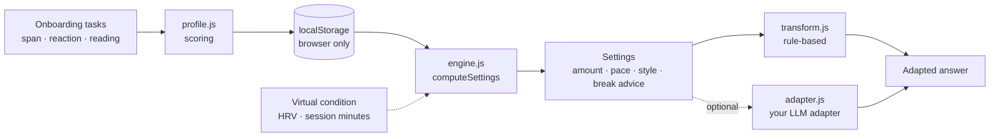

<p align="center">
  <picture>
    <source media="(prefers-color-scheme: dark)" srcset="docs/img/logo-dark.svg">
    
  </picture>
</p>

# Tempoloon — AI that attunes to you.

*Tempoloon (Korean: 템포룬) was formerly called "Attune".*

> **Prototype. Not a medical device. Not a diagnosis. Not scientifically validated.**
> Sensor values in this repo are **virtual** (sliders / sample JSON). No sensor is read.
>
> **License: PolyForm Noncommercial 1.0.0 — source-available, not open source (OSI).** Noncommercial use is free; commercial use needs a separate license. The name "Tempoloon" and the logos are not covered by the license. See [License](#contributing--license).

**English** · [한국어](#한국어)

Fit AI answers to how *you* read: how much information, at what pace, in what shape.
Runs entirely in your browser. No build step, no dependencies, no API key, no server.

- **Look & feel** (`docs/css/style.css`, "Theme v3"): one warm aurora theme for every page: large type, roomy rounded cards, pill controls, a floating brain-balloon hero that follows the preview's load, soft particles; no external fonts, scripts or CDN. Colours for the load scale are unchanged; motion is off under `prefers-reduced-motion`; dark mode follows the system setting. The characters carry no name labels (colour, eye shape and a small accessory only).
- **Landing page** (`docs/index.html`): what Tempoloon is, with an interactive preview (same answer, different virtual condition) and links to the demo, the check-in and GitHub. English by default, Korean toggle.
- **Architecture** (`docs/architecture.html`): inline-SVG data-flow diagram, with each step labelled *Implemented in this prototype* (virtual HRV sliders, rule-based engine) or *Planned* (Apple Watch → iPhone/HealthKit on-device preprocessing → send only a summary → density engine; MCP only after validation). Sample summary format: `docs/data/sample-hrv.json` + `docs/data/hrv-summary.schema.json`.
- **Onboarding** (`docs/onboarding.html`): three short tasks (~4 min) → a personal profile JSON stored in `localStorage`, shown as a radar/gauge, plus a copyable **Style card** (the profile as a short instruction you can paste into your AI's custom instructions). Today the profile is applied automatically only in the demo page; a browser extension is on the roadmap, not built. Optional photo/video slots live in `docs/media/`.
- **Conversation** (`docs/conversation.html`): a simulation of a *voice pace and conversation partner*. Text-to-speech only (Web Speech `speechSynthesis`; **no microphone, no speech recognition**): five speed levels, a pause-length slider, stop / summary / "say again" buttons and a measured speed (words or syllables per minute). Buttons simulate short replies, "what do you mean?", virtual silence and rapid turns; signals (reply length, repeats, pauses, explicit requests) feed `docs/js/partner.js`, which answers in a calm, undoable way (a rejected suggestion cools down for 20 minutes / 15 turns, reasons are shown). Checkpoint and resume cards live in `localStorage`. It reuses your onboarding profile (starting pace and length) and the virtual HRV (starting speed, reply length, thresholds). A load meter (Calm / Rising / Break) uses the same colours. Thresholds are **assumptions**, not validated; on-device voices only unless you allow online ones.
- **Story + mascot** (landing, `docs/js/story.js`, `mascot.js`, `showcase.js`): an 18-second *overload → adjustment → checkpoint → rest → resume → recovered* story with virtual values (also shipped as a ~19 s silent video in `docs/media/`). The optional mascot (a floating bubble-and-arc head; `brand/mascot/`) is a separate variant, the logo stays the default, and arc thickness plus expression carry the state besides colour. With reduced motion there is no autoplay and four still frames are shown.
- **Loop escape** (`docs/js/loop.js`, `docs/js/loopui.js`, section on the conversation page, short card on the landing page): finds conversations that go round in circles (the same question asked again, the AI repeating the same answer or error, long with no progress, a direction that keeps changing) and offers one way out at a time: restate the problem in one line, list what was tried and what did not work, try a different approach, a key prompt for a new session (with a copy button), or choose your own. **Implemented: rule-based local detection** (word overlap / Jaccard, wording patterns in English and Korean, repeated advice and error text, a progress score). It returns a type, a confidence and the evidence. Suggestions follow the partner rules (R15): one at a time, 20-minute cooldown, reasons shown, undoable, and they go first when the virtual load is high. Pasted text is analysed in the page only (nothing is stored or sent; checked by tests). **Planned, not built:** LLM-based meaning check, browser extension, real chat integration. The rules are assumptions, the confidence is a rough estimate, and the wording is a suggestion, never a diagnosis.
- **Load feedback loop** (`docs/js/labels.js`, `docs/js/adapt.js`, `docs/js/loadui.js`, section on the conversation page; **Chrome MV3 prototype** in `extension/`; **local MCP** in `mcp/`): an **I'm overloaded** button records a local label (timestamp, session id, recent turns, signal snapshot) and immediately lowers density and pace via partner rule E3. Labels can be exported or deleted; nothing is sent. The extension (unpacked only — **not submitted to the Chrome Web Store**) adds a floating button on chatgpt.com / claude.ai / gemini.google.com, optional prompt-prefix with confirm-before-insert default on, and chrome.storage.local labels. The MCP server is **stdio local only** (tools: `report_load`, `get_adaptation`, `get_loop_status`) — **no remote deploy, no marketplace submission**. Labels: **prototype / not submitted**. PrivacyGate is a separate track and is not mixed in here. Roadmap: implemented = rule-based local feedback; planned = store listing, remote MCP, SDK packaging, pricing.
- **Individual differences** (landing, `docs/js/individuals.js`): four neutral mascot characters (colour, eye shape, one accessory) receive the same virtual conversation; load rises at a personal pace and Tempoloon steps in at a personal point derived from each one's (virtual) baseline. Labelled "Illustrative — individual differences, not age or gender; virtual values".
- **Demo** (`docs/demo.html`): the same long answer at five density levels, adjusted by your profile and an optional, virtual "today's condition", with a load meter (calm / rising / break).
- **Engine** (`docs/js/engine.js`, `transform.js`): pure JS modules with unit tests (`node --test`).

## The problem

AI answers are often long and dense. How much information a person can comfortably take in varies between people and between days. A one-size-fits-all answer tires some readers out. Tempoloon explores adapting the *output* (speed, amount, expression) instead of asking people to adapt to it.

## How it works: two layers

| Layer | When | Input | Effect |
|---|---|---|---|
| 1. Pre-measured baseline | Once, at onboarding | Number span, reaction/vigilance task, reading-comfort choices | Profile: amount, pace and style levels (1-5) plus a baseline |
| 2. Real-time adjustment (**virtual values only**) | Per session | HRV vs. personal baseline, session length | HRV >= 20% below baseline: one level lighter (>= 40%: two). Load index over threshold: break advice and a minimal summary |

Level mapping and thresholds are **assumptions** in `docs/js/engine.js` (`THRESHOLDS`). They are not validated.

## Quick start

Requires Node 18+ only for tests and the optional dev server.

```bash
git clone <your-fork-url> tempoloon && cd tempoloon
npm test          # node --test, Node built-ins only
npm start         # http://127.0.0.1:8080  (static server for docs/)
```

Or serve `docs/` with any static server (ES modules need http://, not file://), e.g. `python3 -m http.server -d docs`.

**GitHub Pages:** Settings -> Pages -> Deploy from a branch -> `main` / `/docs`.

Try it: open Demo, pick "Low-HRV day" or "Long session + low HRV" and watch the settings and text change. Edit the answer text or the condition JSON freely.

## Two-week self-experiment (label collection)

Goal: collect your own load labels for 14 days and see *when* load goes up (time of day, weekday, minute into a session) and how often automatic suggestions help. Facts only, not a diagnosis. Labels stay in your browser until you export them.

**Day 0 — setup (10 min)**
1. Chrome: load the extension for real chats on ChatGPT, Claude, Gemini or Grok ([extension/README.md](extension/README.md) → "Load unpacked").
2. Open the work rhythm view: [conversation.html#rhythm](https://json-y-q.github.io/tempoloon/conversation.html#rhythm). Keep "Offer suggestions automatically" on and "At most per day" at 3.
3. Optional: in the extension popup, check the same settings.

**Each day**
- When a reply feels heavy, click the mascot and pick a face (a bit heavy / overloaded). Pick calm when it feels fine again. One click, no explanation needed.
- Answer automatic suggestions (Yes / Not now) or just carry on. All three outcomes are recorded.
- On days you use AI chat, aim for at least one pick. Don't force picks on days you don't.

**Export (day 4, 8, 11, 14)**
- Site: Work rhythm → Export JSON. Extension: popup → Export JSON. Put the files in one folder, e.g. `tempoloon-labels/`.
- Clearing browser data deletes labels, so export first.

**Analyse**
```bash
node scripts/analyze-labels.mjs tempoloon-labels/*.json --out report.md          # English
node scripts/analyze-labels.mjs tempoloon-labels/*.json --out report.md --lang ko
```
The report lists records per day, a weekday × time-of-day table, minute-into-session bins and the suggestion acceptance rate. Labels with the same id are merged. With fewer than 5 load presses it says so instead of showing patterns.

**Checklist**
- [ ] The mascot shows on each chat site. If it says "Couldn't find the chat box", paste the copied note yourself and write down the site.
- [ ] At least one pick on days with AI use
- [ ] No more than 3 automatic suggestions a day, and quiet days after passing
- [ ] Exported on day 4, 8, 11 and 14
- [ ] Report read only after ≥5 load presses; notes on anything odd (missed picks, hidden mascot)

## Repository layout

```
extension/ Chrome MV3 mascot prototype for ChatGPT/Claude/Gemini/Grok (unpacked only; not Web Store)
mcp/        local MCP middleware prototype: stdio, or Streamable HTTP on 127.0.0.1 with a token (not deployed, no marketplace)
docs/       static web app (GitHub Pages root): index.html (landing), onboarding.html, conversation.html, architecture.html, demo.html, css/, js/ (incl. partner, voice, story, mascot, individuals, loop, showcase, conversation), img/ (logos, mascot SVGs), data/ (sample summary + schema), media/ (hero video + optional image slots), favicon.svg
  js/       profile.js, engine.js, transform.js, adapter.js, partner.js, voice.js, story.js, mascot.js, individuals.js, typing.js, loop.js, labels.js, adapt.js (pure logic, tested) · loopui.js, loadui.js, landing.js, onboarding.js, architecture.js, conversation.js, showcase.js, stylecard.js, charts.js, media.js, demo.js, ui.js, storage.js, i18n.js (browser)
test/       node:test unit and static checks (npm test)
scripts/    serve.js (local static server, npm start), gen-mascot.mjs (writes the mascot SVGs), stamp.mjs (cache-busting), analyze-labels.mjs (exported labels → Markdown summary)
brand/      logo work: BRAND.md (spec + comparison), overview.png, concept-2/ (chosen, applied to docs/),
            concept-1/ and concept-1b/ (candidates), archive/ (earlier concepts),
            mascot/ (optional mascot variant, separate from the logo)
LICENSE     PolyForm Noncommercial 1.0.0 (source-available)
NOTICE      required notice, brand/name exclusion, commercial-use note
```

## Architecture



Optional LLM adapter: implement `{ name, rewrite({ text, settings, systemPrompt }) => Promise<string> }` and set `window.tempoloonAdapter`. Without it, or on error/timeout, the rule-based transform is used. The repo ships no network code. See `docs/js/adapter.js`.

## Roadmap (not implemented)

1. Validation: literature review, pilot studies, better measures and thresholds.
2. Apple Watch / HealthKit: on-device HRV collection (iOS companion app).
3. iPhone on-device preprocessing: only derived values (e.g. change vs. baseline) would leave the device, never raw signals.
4. Cloud or small on-device model for density control (via the adapter interface).
5. MCP server integration, after the earlier steps are validated.
6. Loop escape, next steps (planned, not built): an LLM-based check of whether a chat is really stuck, on-device embeddings, a browser extension and real chat integration. Today only the rule-based local detection exists.

## Privacy principles

- Profile and language choice live in `localStorage` only. Nothing is uploaded; shipped code contains no network calls (checked by a test).
- Export, import and delete your profile on the results page.
- Future biometric features must be opt-in, minimal, processed on-device first, and deletable.

## Limitations

- Not a medical device; not a diagnosis; no clinical claims. Tasks are simple heuristics, **not validated psychometrics**; results vary by device, input method and day.
- HRV and session values are **virtual**. Real sensor data, baselines and thresholds are unvalidated future work.
- Text transform is extractive and rule-based: it drops and regroups sentences and can lose nuance. Sentence splitting is heuristic (EN/KO).
- Tasks are visual and need keyboard, mouse or touch; not suitable for everyone. Reading/typing time is not normalised for language ability.
- Single-browser storage: clearing site data deletes the profile.
- Conversation page: a simulation. Speech is text-to-speech only (no microphone); voice availability and audio differ per browser. Signals, thresholds, cooldowns and wording are design assumptions, not validated and not reviewed by a lawyer. Silence and rapid turns are simulated, not measured.
- Loop escape is rule-based and local. Word overlap misses paraphrases and can mistake a deliberate follow-up for a repeat; the confidence is a rough estimate, the thresholds are assumptions and nothing has been validated on real conversations. It only reads text you paste; it does not read any chat page.
- Story and mascot are illustrations with virtual numbers; the four characters in "Individual differences" show that personal baselines differ, not that any group differs. No age or gender claim is made.

## Contributing & license

**License: [PolyForm Noncommercial License 1.0.0](LICENSE).** This repository is **source-available, not open source** (it does not meet the OSI definition).

- Allowed: personal, research, educational and other noncommercial use, including by charities, schools, public research and government bodies (see the license text for exact terms).
- Not allowed without a separate agreement: commercial use. That needs a separate commercial license or paid API access.
- Status: no commercial license is on offer yet and **no API plan or pricing exists** — a paid API/hosted option is only a plan under consideration, with no date or promise.
- Questions or commercial interest: open an issue in this repository on GitHub, or reach the author (Sehan Yun) through the GitHub profile.
- Name and logos: the name "Tempoloon" (템포룬) and the logos in `brand/` and `docs/img/` are **not** covered by the license ([NOTICE](NOTICE)). The name is **not a registered trademark**; trademark checks are still pending. The project was formerly called "Attune".
- Contributions: see [CONTRIBUTING.md](CONTRIBUTING.md) (contributions are licensed the same way, plus a simple grant to the owner).

Brand: the chosen logo is concept 2 (a brain-shaped speech bubble whose five top arcs shift calm → rising → break, with arc thickness as a non-colour cue). It is specified in [`brand/BRAND.md`](brand/BRAND.md) and applied to `docs/`; the demo's load meter uses the same three-zone colour scale. Candidates (concept 1, 1b) and earlier concepts stay in `brand/`. Name and marks are unregistered; trademark check pending.

---

## 한국어

**템포룬(Tempoloon) — AI가 나에게 맞춰 말해 주는 관계.** 사람과 AI 사이의 "사회생활"처럼, AI가 나의 인지 속도와 정보량에 맞춰 말하도록 돕는 프로토타입입니다. *이전 이름은 "Attune"였습니다.*

> **프로토타입입니다. 의료기기가 아니며, 진단이 아니고, 과학적으로 검증되지 않았습니다.**
> 이 저장소의 센서 값은 **가상 값**(슬라이더/샘플 JSON)입니다. 실제 센서는 읽지 않습니다.
>
> **라이선스: PolyForm Noncommercial 1.0.0 — 소스 공개이며 오픈소스(OSI)가 아닙니다.** 비상업적 사용은 무료이고, 상업적 이용은 별도 라이선스가 필요합니다. "템포룬(Tempoloon)"이라는 이름과 로고는 라이선스에 포함되지 않습니다. [기여 및 라이선스](#기여-및-라이선스) 참고.

AI 답변을 *내가* 읽는 방식에 맞춥니다: 정보량, 속도, 표현 형태. 모든 것이 브라우저 안에서 동작합니다. 빌드, 의존성, API 키, 서버가 필요 없습니다.

- **디자인** (`docs/css/style.css`의 "Theme v3"): 모든 페이지에 같은 따뜻한 오로라 테마를 씁니다. 큰 타이포, 넉넉한 둥근 카드, 알약형 버튼, 미리보기의 부하를 따라가는 떠다니는 뇌풍선 히어로, 부드러운 입자. 외부 폰트·스크립트·CDN은 없고, 부하 색 체계는 그대로이며, 모션 줄이기 설정에서는 움직임이 꺼지고, 다크 모드는 시스템 설정을 따릅니다. 캐릭터에는 이름 라벨이 없고 색·눈 모양·작은 소품으로만 구분합니다.
- **랜딩 페이지** (`docs/index.html`): 템포룬 소개와 인터랙티브 미리보기(같은 답변이 가상 컨디션에 따라 달라짐), 데모·체크인·GitHub 링크. 기본 영어, 한국어 전환.
- **구조** (`docs/architecture.html`): 인라인 SVG 데이터 흐름도. 각 단계를 *이 프로토타입에 구현됨*(가상 HRV 슬라이더, 규칙 기반 엔진)과 *계획*(Apple Watch → iPhone/HealthKit 온디바이스 전처리 → 요약만 전송 → 밀도 조절 엔진, MCP는 검증 후)으로 구분. 요약 형식 예: `docs/data/sample-hrv.json`, `docs/data/hrv-summary.schema.json`.
- **온보딩** (`docs/onboarding.html`): 짧은 과제 3개(약 4분) → 개인 프로파일 JSON을 `localStorage`에 저장하고 레이더/게이지로 보여 주며, AI의 맞춤 설정에 붙여 넣을 수 있는 짧은 지시문 **스타일 카드**를 복사할 수 있음. 현재 자동 적용은 데모 페이지에서만 되며 브라우저 확장은 로드맵(미구현). 선택 사진·영상 슬롯은 `docs/media/`.
- **대화** (`docs/conversation.html`): *음성 속도·대화 파트너* 시뮬레이션. 텍스트 읽어주기(TTS)만 사용(Web Speech `speechSynthesis`, **마이크·음성 인식 없음**): 속도 5단계, 멈춤 길이 슬라이더, 정지·요약·다시 듣기 버튼, 측정된 속도(분당 단어/음절). 버튼으로 짧은 답, "무슨 말이야?", 가상 침묵, 빠른 연속 턴을 시뮬레이션하고, 신호(답변 길이·반복·멈춤·직접 요청)는 `docs/js/partner.js`가 차분하고 되돌릴 수 있게 처리합니다(거절한 제안은 20분/15턴 동안 쉬고, 이유를 보여 줌). 체크포인트·이어하기 카드는 `localStorage`에 저장됩니다. 온보딩 프로파일(시작 속도·분량)과 가상 HRV(시작 속도·답변 길이·임계값)를 반영하고, 부하 미터(안정/상승/휴식)는 같은 색을 씁니다. 임계값은 **가정**이며 검증되지 않았고, 온라인 음성은 허용할 때만 씁니다.
- **스토리 + 마스코트** (랜딩, `docs/js/story.js`, `mascot.js`, `showcase.js`): *과부하 → 조정 → 체크포인트 → 휴식 → 이어하기 → 회복* 18초 스토리(가상 값, `docs/media/`에 약 19초 무음 영상도 포함). 선택 마스코트(말풍선+아크 머리만 떠다니는 형태, `brand/mascot/`)는 별도 변형이며 기본은 로고 그대로입니다. 색 외에 아크 두께와 표정으로도 상태를 구분하고, 모션 줄이기 설정에서는 자동 재생 없이 정지 프레임 4장을 보여 줍니다.
- **루프 탈출** (`docs/js/loop.js`, `docs/js/loopui.js`, 대화 페이지 섹션, 랜딩 카드 1개): 같은 질문이 반복되거나, AI가 같은 답·오류를 되풀이하거나, 길어지는데 진전이 없거나, 방향이 계속 바뀌는 “제자리 맴돌기” 대화를 찾아 한 번에 하나씩 빠져나올 길을 제안합니다(문제 한 줄 재정리, 시도한 것·안 된 것 정리, 다른 접근, 새 세션용 핵심 프롬프트(복사 버튼), 직접 고르기). **구현됨: 규칙 기반 로컬 감지**(단어 겹침/자카드, 영어·한국어 표현 패턴, 반복되는 조언·오류 문구, 진전 점수)로 유형·신뢰도·근거를 돌려줍니다. 제안은 파트너 규칙(R15)을 따릅니다: 한 번에 하나, 20분 쿨다운, 이유 표시, 되돌리기 가능, 가상 부하가 높으면 먼저 제안. 붙여 넣은 글은 이 페이지 안에서만 분석하며 저장·전송하지 않습니다(테스트로 확인). **계획(미구현):** LLM 기반 의미 판정, 브라우저 확장, 실제 챗 연동. 규칙은 가정이고 신뢰도는 대략적 추정이며, 문구는 제안일 뿐 진단이 아닙니다.
- **부하 피드백 루프** (`docs/js/labels.js`, `adapt.js`, `loadui.js`, 대화 페이지 섹션; **Chrome MV3 프로토타입** `extension/`; **로컬 MCP** `mcp/`): **「지금 과부하예요」** 버튼이 로컬 라벨(타임스탬프·세션 ID·최근 턴·신호 스냅샷)을 남기고 partner 규칙 E3로 밀도·속도를 즉시 낮춥니다. 라벨은 내보내기/삭제 가능, 전송 없음. 확장(언팩만 — **크롬 웹스토어 미제출**)은 chatgpt.com / claude.ai / gemini.google.com에 플로팅 버튼, 기본값「삽입 전 확인」프롬프트 접두, chrome.storage.local 라벨. MCP는 **stdio 로컬만**(`report_load`, `get_adaptation`, `get_loop_status`) — **원격 배포·마켓 제출 없음**. 라벨: **프로토타입/미제출**. PrivacyGate와 섞지 않음. 로드맵: 구현됨=규칙 기반 로컬 피드백; 계획=스토어 등록·원격 MCP·SDK·가격.
- **개인차** (랜딩, `docs/js/individuals.js`): 색·눈 모양·작은 액세서리만 다른 중립 마스코트 4명이 같은 가상 대화를 받습니다. 부하가 오르는 속도와 템포룬이 개입하는 시점은 각자의 (가상) 기준선에서 나옵니다. "예시 — 개인차를 보여 주는 그림이며 연령·성별과는 무관합니다. 가상의 값입니다" 라벨을 붙였습니다.
- **데모** (`docs/demo.html`): 같은 긴 답변을 5단계 밀도로 보여 주며, 프로파일과 선택적인 가상 "오늘의 컨디션"으로 조절하며, 부하 미터(안정/상승/휴식)를 보여 줌.
- **엔진** (`docs/js/engine.js`, `transform.js`): 단위 테스트(`node --test`)가 있는 순수 JS 모듈.

### 문제

AI 답변은 길고 빽빽한 경우가 많습니다. 한 번에 편하게 받아들이는 정보량은 사람마다, 날마다 다릅니다. 템포룬은 사람이 AI에 맞추는 대신 AI의 *출력*(속도, 양, 표현)을 맞추는 방법을 탐색합니다.

### 작동 방식: 2레이어

| 레이어 | 시점 | 입력 | 효과 |
|---|---|---|---|
| 1. 사전 측정 기준선 | 온보딩 시 1회 | 숫자 기억 폭, 반응/주의 과제, 읽기 편안함 선택 | 정보량·속도·표현 레벨(1~5)과 기준선 프로파일 |
| 2. 실시간 보정 (**가상 값만**) | 세션 중 | 개인 기준선 대비 HRV, 사용 시간 | HRV가 기준선보다 20% 이상 낮으면 한 단계 낮춤(40% 이상: 두 단계). 부하 지수가 임계 초과 시 휴식 안내와 최소 요약 |

레벨 매핑과 임계값은 `docs/js/engine.js`의 `THRESHOLDS`에 있는 **가정**이며 검증되지 않았습니다.

### 빠른 시작

Node 18 이상은 테스트와 선택적 개발 서버에만 필요합니다.

```bash
git clone <포크-주소> tempoloon && cd tempoloon
npm test          # node --test, Node 내장 기능만 사용
npm start         # http://127.0.0.1:8080  (docs/ 정적 서버)
```

또는 아무 정적 서버로 `docs/`를 서빙하세요(ES 모듈은 file://이 아니라 http://가 필요). 예: `python3 -m http.server -d docs`.

**GitHub Pages:** Settings -> Pages -> Deploy from a branch -> `main` / `/docs`.

데모에서 "HRV가 낮은 날" 또는 "장시간 사용 + 낮은 HRV"를 눌러 설정과 텍스트가 바뀌는 것을 확인하세요. 답변 텍스트와 컨디션 JSON은 자유롭게 수정할 수 있습니다.

### 2주 자기 실험 (라벨 수집)

목표: 14일 동안 내 부하 라벨을 모아 *언제* 부하가 오르는지(시간대·요일·세션 몇 분째)와 자동 제안이 얼마나 도움이 됐는지 봅니다. 사실만 보며 진단이 아닙니다. 라벨은 내보내기 전까지 내 브라우저에만 있습니다.

**0일차 — 준비 (10분)**
1. 크롬: 실제 대화(ChatGPT·Claude·Gemini·Grok)용 확장을 설치합니다([extension/README.md](extension/README.md) → "압축해제된 확장 프로그램 로드").
2. 작업 리듬 화면을 엽니다: [conversation.html#rhythm](https://json-y-q.github.io/tempoloon/conversation.html#rhythm). "자동으로 제안하기"는 켜고 "하루 최대"는 3으로 둡니다.
3. 선택: 확장 팝업에서도 같은 설정을 확인합니다.

**매일**
- 답이 무겁게 느껴지면 마스코트를 눌러 얼굴(조금 무거움 / 과부하)을 고릅니다. 다시 괜찮아지면 평온을 고릅니다. 한 번 클릭이면 되고 설명은 필요 없습니다.
- 자동 제안에는 "네, 좋아요 / 지금은 괜찮아요"로 답하거나 그냥 넘어가도 됩니다. 세 경우 모두 기록됩니다.
- AI 대화를 쓴 날은 최소 한 번 고르는 것을 목표로 합니다. 안 쓴 날은 억지로 고르지 않습니다.

**내보내기 (4·8·11·14일차)**
- 사이트: 작업 리듬 → JSON 내보내기. 확장: 팝업 → Export JSON. 파일은 한 폴더(예: `tempoloon-labels/`)에 모읍니다.
- 브라우저 데이터를 지우면 라벨도 지워지니 먼저 내보내세요.

**분석**
```bash
node scripts/analyze-labels.mjs tempoloon-labels/*.json --out report.md --lang ko
```
보고서에는 날짜별 기록 수, 요일 × 시간대 표, 세션 경과 분 구간, 제안 수락률이 나옵니다. id가 같은 라벨은 합칩니다. 부하 입력이 5개 미만이면 패턴 대신 그 사실을 적습니다.

**체크 항목**
- [ ] 각 대화 사이트에 마스코트가 보인다. "입력창을 찾지 못함"이 뜨면 복사된 메모를 직접 붙여넣고 사이트를 적어 둔다.
- [ ] AI를 쓴 날 최소 한 번 고름
- [ ] 자동 제안은 하루 3회 이하, 넘긴 뒤에는 조용한 날이 있음
- [ ] 4·8·11·14일차에 내보냄
- [ ] 부하 입력 5개 이상 모인 뒤에 보고서를 읽음, 이상한 점(빠뜨린 입력, 안 보이는 마스코트) 메모

### 저장소 구조

```
extension/ ChatGPT·Claude·Gemini·Grok용 Chrome MV3 마스코트 프로토타입(언팩만·웹스토어 미제출)
mcp/        로컬 MCP 미들웨어 프로토타입: stdio 또는 127.0.0.1 Streamable HTTP+토큰(배포·마켓 없음)
docs/       정적 웹앱(GitHub Pages 루트): index.html(랜딩), onboarding.html(온보딩), conversation.html(대화), architecture.html(구조), demo.html, css/, js/(partner·voice·story·mascot·individuals·loop·showcase·conversation 포함), img/(로고·마스코트 SVG), data/(요약 샘플·스키마), media/(히어로 영상 + 선택 이미지 슬롯), favicon.svg
  js/       profile.js, engine.js, transform.js, adapter.js, partner.js, voice.js, story.js, mascot.js, individuals.js, typing.js, loop.js, labels.js, adapt.js (순수 로직, 테스트됨) · loopui.js, loadui.js, landing.js, onboarding.js, architecture.js, conversation.js, showcase.js, stylecard.js, charts.js, media.js, demo.js, ui.js, storage.js, i18n.js (브라우저)
test/       node:test 단위·정적 검사 (npm test)
scripts/    serve.js (로컬 정적 서버, npm start), gen-mascot.mjs (마스코트 SVG 생성), stamp.mjs (캐시 무효화), analyze-labels.mjs (내보낸 라벨 → Markdown 요약)
brand/      로고 작업: BRAND.md(사양·비교), overview.png, concept-2/(확정, docs/에 적용),
            concept-1/·concept-1b/(후보), archive/(이전 시안),
            mascot/(로고와 별도인 선택 마스코트 변형)
LICENSE     PolyForm Noncommercial 1.0.0 (소스 공개)
NOTICE      필수 고지, 이름·로고 제외, 상업 이용 안내
```

### 아키텍처

위 영문 섹션의 mermaid 다이어그램과 같습니다. 선택적 LLM 어댑터는 `{ name, rewrite({ text, settings, systemPrompt }) => Promise<string> }`를 구현해 `window.tempoloonAdapter`에 지정합니다. 어댑터가 없거나 오류/시간 초과면 규칙 기반 변환을 사용합니다. 이 저장소에는 네트워크 코드가 없습니다.

### 로드맵 (미구현)

1. 검증: 문헌 조사, 파일럿, 더 나은 측정 도구와 임계값.
2. Apple Watch / HealthKit: 온디바이스 HRV 수집(iOS 컴패니언 앱).
3. iPhone 온디바이스 전처리: 원시 신호는 기기 밖으로 나가지 않고, 파생 값(예: 기준선 대비 변화량)만 전송 대상.
4. 클라우드 또는 경량 온디바이스 모델로 밀도 조절(어댑터 인터페이스 활용).
5. 앞 단계 검증 이후 MCP 서버 연동.
6. 루프 탈출 다음 단계(계획, 미구현): 챗이 정말 막혔는지 LLM으로 의미 판정, 온디바이스 임베딩, 브라우저 확장, 실제 챗 연동. 지금은 규칙 기반 로컬 감지만 있습니다.

### 프라이버시 원칙

- 프로파일과 언어 선택은 `localStorage`에만 저장됩니다. 업로드는 없으며 배포 코드에 네트워크 호출이 없습니다(테스트로 확인).
- 결과 화면에서 프로파일을 내보내기, 가져오기, 삭제할 수 있습니다.
- 향후 생체 신호 기능은 옵트인, 최소 수집, 온디바이스 우선 처리, 삭제 가능이어야 합니다.

### 한계

- 의료기기가 아니며 진단이 아닙니다. 임상적 주장은 없습니다. 과제는 단순한 휴리스틱이며 **검증된 심리 측정 도구가 아닙니다**. 기기, 입력 방식, 날에 따라 결과가 달라집니다.
- HRV와 사용 시간 값은 **가상 값**입니다. 실제 센서 데이터, 기준선, 임계값은 검증되지 않은 향후 과제입니다.
- 텍스트 변환은 문장을 고르고 재배열하는 규칙 기반 방식이라 뉘앙스가 사라질 수 있습니다. 문장 분리는 휴리스틱입니다(영어/한국어).
- 과제는 시각 기반이며 키보드, 마우스, 터치가 필요해 모두에게 적합하지 않습니다. 언어 능력에 따른 읽기·입력 시간은 보정하지 않습니다.
- 브라우저별 저장이라 사이트 데이터를 지우면 프로파일도 사라집니다.
- 대화 페이지는 시뮬레이션입니다. 음성은 TTS만 쓰며(마이크 없음) 브라우저마다 음성·소리가 다릅니다. 신호·임계값·쿨다운·문구는 검증되지 않은 설계 가정이며 법률 검토를 받지 않았습니다. 침묵과 빠른 연속 턴은 측정이 아니라 시뮬레이션입니다.
- 루프 탈출은 규칙 기반 로컬 방식입니다. 단어 겹침은 말바꿈을 놓치거나 의도한 후속 질문을 반복으로 오해할 수 있습니다. 신뢰도는 대략적 추정이고 임계값은 가정이며 실제 대화로 검증하지 않았습니다. 붙여 넣은 글만 읽고 챗 페이지는 읽지 않습니다.
- 스토리와 마스코트는 가상 수치의 일러스트입니다. "개인차"의 네 캐릭터는 개인 기준선이 서로 다르다는 것을 보여 줄 뿐 어떤 집단이 다르다는 뜻이 아니며, 연령·성별에 관한 주장은 하지 않습니다.

### 기여 및 라이선스

**라이선스: [PolyForm Noncommercial License 1.0.0](LICENSE).** 이 저장소는 **소스 공개(source-available)이며 오픈소스가 아닙니다**(OSI 정의를 충족하지 않음).

- 허용: 개인, 연구, 교육 등 비상업적 사용. 자선단체, 학교, 공공 연구기관, 정부기관의 사용도 포함됩니다(정확한 조건은 라이선스 원문 참조).
- 별도 계약 없이는 불가: 상업적 이용. 별도의 상용 라이선스 또는 유료 API 이용이 필요합니다.
- 현재 상태: 제공 중인 상용 라이선스는 아직 없고 **API 요금제도 아직 없습니다**. 유료 API/호스팅은 검토 중인 계획일 뿐이며 일정이나 약속은 없습니다.
- 문의·상업적 관심: GitHub 이 저장소의 issues에 남기거나, GitHub 프로필(Sehan Yun)로 연락해 주세요.
- 이름과 로고: "템포룬(Tempoloon)"이라는 이름과 `brand/`, `docs/img/`의 로고는 라이선스에 **포함되지 않습니다**([NOTICE](NOTICE)). 이 이름은 **등록 상표가 아니며** 상표 검토가 아직 진행 중입니다. 이전 이름은 "Attune"였습니다.
- 기여: [CONTRIBUTING.md](CONTRIBUTING.md) 참고(기여물도 같은 라이선스이며, 소유자에게 간단한 이용 허락을 부여합니다).
